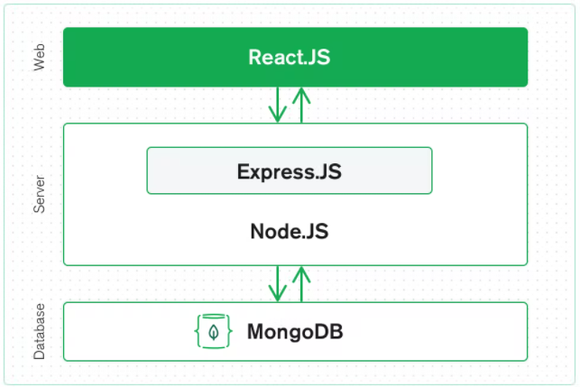

# 

> ### MERN stack codebase containing real world examples (CRUD, auth, advanced patterns, etc) that adheres to the [RealWorld](https://github.com/gothinkster/realworld) spec and API.

### [Demo](https://demo.realworld.io/)&nbsp;&nbsp;&nbsp;&nbsp;[RealWorld](https://github.com/gothinkster/realworld)

This codebase was created to demonstrate a fully fledged fullstack application built with the MERN stack including CRUD operations, authentication, routing, pagination, and more.

We've gone to great lengths to adhere to the MERN stack community styleguides & best practices.

For more information on how to this works with other frontends/backends, head over to the [RealWorld](https://github.com/gothinkster/realworld) repo.

# How it works

The MERN stack refers to the following set of technologies:

- MongoDB - which is a document database
- ExpressJS - a super simple NodeJS framework
- ReactJS - the library used for the client
- NodeJS - the web server we use

You can find more info on this on [MongoDB's website](https://www.mongodb.com/mern-stack), but I will borrow their diagram and explain it a little here.

## ReactJS

[React](https://reactjs.org/) is a popular JavaScript library to create dynamic client-side applications. This is our front-end, where all the user interactions will happen.

# Getting started

> npm install, npm start, etc.
